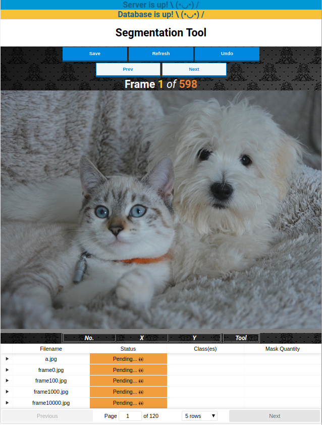
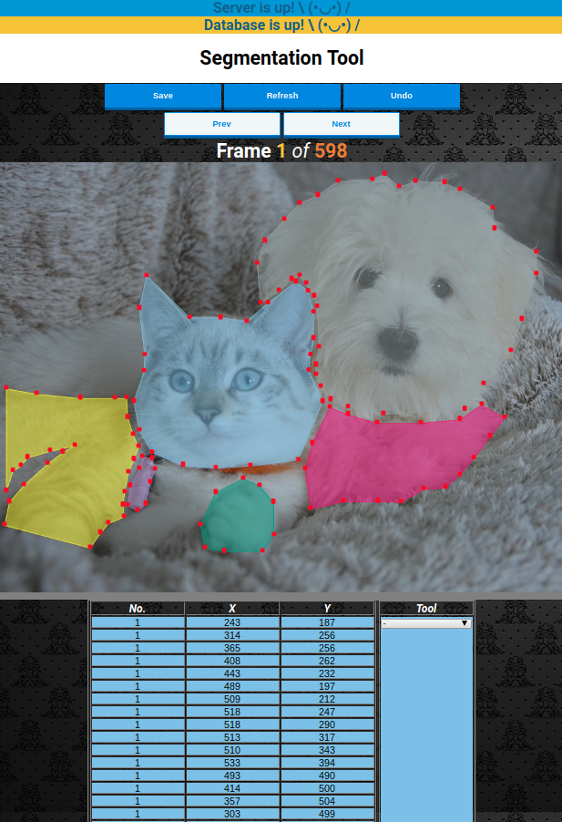

# SegMe
> SegMe is an annotation tool that can be used to create segmentation masks and capture the results in a convenient .json file.

[![NPM Version][npm-image]][npm-url]
[![Build Status][travis-image]][travis-url]

SegMe is a tool that I developed for extracting segmented masks from images. My rationale was to create a robust tool that could quickly create masks that can be used to train machine learning models. Doing so gave me some experience using React and allowed me to create data in a format that can be fed into existing Mask-RCNN implementations with some modest tweaking. 

### User Interface



### Canvas with Annotations



## Installation

OS X & Linux:

```sh
cd $WORKING_DIRECTORY
git clone https://github.com/ShujaKhalid/bbox_tool
cd bbox_tool
npm install

```

## Development setup

To begin using the tool after the installation of the dependencies, modify and run the following script: 

```sh
./seg-tool.sh # Runs the React environment on port 3000 and the back-end server on port 3001 

```

Alternatively, open two terminals and navigate to the working directory.

Run the following command in one of the terminals to start the data collection server:
```sh
node server/server.js # Runs the back-end server on port 3001 

```

Run the following command in the other terminal to launch the application.
```sh
npm start # Runs the React environment on port 3000

```

## Usage example

The product is incredibly simple to use due to its user-friendly interface!

1.) To begin segmenting, place the images in the ./src/img_vid1/ folder. 

Note: Atleast 5 .jpg images must be put in the directory due to some erroneous logic in the code related to the ReactTable extension)

2.) Follow the development setup to launch the app if it has not been done already.

3.) Double click on the canvas to create a vertex

4.) Continue double-clicking on the canvas to form a polygon around the desired object

5.) Press 'ENTER' on the keyboard to create another polygon on the same object 

6.) Press 'UNDO' to undo a recently created vertex

7.) Press 'REFRESH' to clear all of the content on the screen (Hint: This content is not recoverable is it had not been saved previously)

8.) Double click on a row in the table below to pull up the image along with its previous annotation from the database

Note: If at any time the annotations are not visible upon clicking a row in the table, the connection between the tool and the database has most likely been disrupted.  

9.) The only time the user can save their content to the database is by clicking in 'SAVE'

10.) The user will also have to modify the classes within ./src/App.js to ensure that they are able to choose classes based on their application in the drop down list.

Note: The code as it currently stands has been structured for use with niche bio-medical data  

11.) 

## Release History

* 0.0.1
    * Core functionality remains a work in progress

## Meta

Shuja Khalid – [LinkedIn](https://www.linkedin.com/in/shujakhalid/) – s.khalid@cs.toronto.edu

Distributed under the MIT license. See ``LICENSE`` for more information.

[https://github.com/ShujaKhalid/](https://github.com/ShujaKhalid/)

## Contributing

1. Fork it (<https://github.com/ShujaKhalid/bbox-tool/fork>)
2. Create your feature branch (`git checkout -b feature/fooBar`)
3. Commit your changes (`git commit -am 'Add some fooBar'`)
4. Push to the branch (`git push origin feature/fooBar`)
5. Create a new Pull Request

## TODO

A lot of works remains to be done to refine the app and clean up the code.

1.) Refine bounding box capturing mode (currently depracated)

2.) Break the app into sub-modules

3.) Remove legacy code

4.) Fix bug in code that requires atleast 5 images to be added to start the project

5.) Remove the limitation of only being able to edit files with a .jpg extension

6.) Allow for a canvas that dynamically changes based on the users input image

7.) Clean up the files in the code

The application has been used in React and since this was my first time using React, the code is a bit rough around the edges. Please let me know if there are improvements that can be made (I am sure there are plenty).


<!-- Markdown link & img dfn's -->
[npm-image]: https://img.shields.io/npm/v/datadog-metrics.svg?style=flat-square
[npm-url]: https://npmjs.org/package/datadog-metrics
[npm-downloads]: https://img.shields.io/npm/dm/datadog-metrics.svg?style=flat-square
[travis-image]: https://img.shields.io/travis/dbader/node-datadog-metrics/master.svg?style=flat-square
[travis-url]: https://travis-ci.org/dbader/node-datadog-metrics
